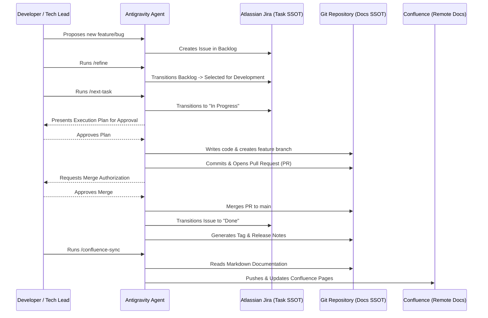

# Drunken Agy: Software Development Workflow Guide

Welcome to the Drunken-Agy project! This repository relies on an advanced, highly-automated agentic software development lifecycle (SDLC). To prevent data fragmentation (split-brain) and maintain a stable codebase, all human developers and AI Agents MUST strictly adhere to the following Single Source of Truth (SSOT) protocols.

---

## 🗺️ SDLC Architecture Diagram

The following diagram illustrates the flow of a standard development cycle between the Developer, the Agent, and our two Single Sources of Truth (Jira and the Git Repo).

---

## 🚀 How to Execute the Workflow (Commands)

If you are a new developer or Tech Lead picking up this repository, here is exactly how to drive the Agent using standard Slash Commands:

### 1. Planning & Intake (`/refine`)
- **What it does:** Scans the Jira `Backlog`, proposes requirements, and moves refined tasks to `Selected for Development` (To Do).
- **When to use:** At the start of a Sprint or when the To Do column is empty.

### 2. Execution (`/next-task`)
- **What it does:** Picks the highest priority ticket from Jira's To Do lane, moves it to `In Progress`, and immediately presents an **Execution Plan** for you to approve before it writes any code.
- **When to use:** Whenever you want the Agent to start working on the next feature.

### 3. Auditing (`/audit`)
- **What it does:** Scans the entire codebase for architecture compliance, security risks, technical debt, and documentation gaps. Generates a scored report and proposes cleanup Jira tasks.
- **When to use:** At the end of a milestone or before a major release to ensure code health.

### 4. Documentation Sync (`/confluence-sync`)
- **What it does:** Reads local `.md` files (like this guide or `README.md`) and pushes them to Atlassian Confluence, ensuring the remote wiki matches the Git repository.
- **When to use:** After you merge any PR that updates Markdown documentation.

---

## 🏗️ 1. Task Management: Jira is the SSOT

We **do not** use local Markdown files (`.agents/board/*.md`) or the `kanban-board` MCP to track task status.

- **Intake & Backlog:** All new features, bugs, and ideas must be created as a Jira Ticket.
- **Workflow Lanes:** Issues flow through standard Jira columns: `Backlog` -> `Selected for Development` (To Do) -> `In Progress` -> `Done`.
- **Command:** Never manually manipulate local task files. If you need to check task status, rely on the Jira web board or use `scripts/jira_bridge.py`.

---

## 📚 2. Documentation: Git Repo is the SSOT

Documentation lives alongside the code. We do not edit documentation directly on Confluence.

- **Local Edits:** All technical documentation (e.g., `README.md`, `WORKFLOW_GUIDE.md`) must be authored and edited as standard Markdown files in this repository.
- **Confluence Sync:** We maintain a bridge to Atlassian Confluence. Once a Markdown document is updated and merged into `main`, trigger the sync using `/confluence-sync`.

---

## 🛡️ 3. Git Protocol: Branching, PRs, and Safety Gates

Direct commits to the `main` or `develop` branches are strictly prohibited. 

- **Feature Branches:** All work must take place on a dedicated branch (e.g., `feature/workflow-guide`).
- **Pull Requests (PR):** When work is completed, you must open a Pull Request against `main`.
- **Merge Authorization Gate:** **Agents are strictly forbidden from merging PRs autonomously without explicit human oversight.** 
  - Before a merge, the Agent will ask: *"Will you review and merge this PR yourself, or do you want me to merge it for you?"*
- **Release and Tagging:** Once merged into `main`, a Semantic Git Tag (e.g., `v1.3.0`) MUST be generated along with structured Release Notes.
